# 📊 ML-06: Python for Machine Learning (Data Preparation Pipeline)

### Mata Kuliah: INF2542 • Pembelajaran Mesin | Praktikum Modul 06

  <b>Dokumentasi komprehensif alur pengolahan data machine learning: Dari Data Mentah → Inspeksi Kualitas → Pembersihan (Cleaning) → Transformasi Kategori & Tipe Data → Visualisasi Informasi → Pemisahan Fitur dan Target Siap Dimodelkan (Scikit-Learn).</b>

---

[📌 Identitas Mahasiswa](#-identitas-mahasiswa) •
[📖 Pendahuluan & Workflow](#-pendahuluan--workflow-pipeline) •
[📚 Rangkuman Sintaks Slide PDF](#-rangkuman-sintaks-slide-pdf) •
[🧪 Bedah Praktikum Terbimbing](#-bedah-praktikum-terbimbing) •
[🎯 Latihan Mandiri (A, B, C)](#-latihan-mandiri-di-colab) •
[🏆 Challenge: Temukan 3 Masalah Data](#-challenge-temukan-3-masalah-data) •
[✅ Checklist Ketercapaian](#-checklist-ketercapaian-refleksi) •
[🚀 Cara Menjalankan](#-cara-menjalankan-notebook)

---

## 📌 Identitas Mahasiswa

<table align="center">
  <tr>
    <th>Informasi</th>
    <th>Keterangan</th>
  </tr>
  <tr>
    <td><b>Nama Lengkap</b></td>
    <td>Gathan Hilabi</td>
  </tr>
  <tr>
    <td><b>Nomor Induk Mahasiswa (NIM)</b></td>
    <td>60324059</td>
  </tr>
  <tr>
    <td><b>Mata Kuliah</b></td>
    <td>Machine Learning (INF2542)</td>
  </tr>
  <tr>
    <td><b>Modul / Pertemuan</b></td>
    <td>Pertemuan 06 – Python for Machine Learning</td>
  </tr>
  <tr>
    <td><b>Sub-CPMK</b></td>
    <td>Sub-CPMK 9.1: Terampil menggunakan pustaka Python dan menggunakannya untuk membangun proses pengolahan data ML</td>
  </tr>
  <tr>
    <td><b>Alokasi Waktu Pembelajaran</b></td>
    <td>Blok Minggu 06–07 (300 Menit)</td>
  </tr>
  <tr>
    <td><b>File Notebook Utama</b></td>
    <td><code>059_GathanHilabi_Pertemuan06.ipynb</code> <code>059_GathanHilabi_Challenge_Pertemuan06.ipynb</code> (Khusus Challenge)</td>
  </tr>
</table>

---

## 📖 Pendahuluan & Workflow Pipeline

### Filosofi Data Preparation:
> *"Garbage In, Garbage Out"* (GIGO). Model machine learning secanggih apa pun tidak akan pernah menghasilkan prediksi yang optimal jika dilatih menggunakan data mentah yang kotor, terdistorsi, atau inkonsisten.

Data cleaning **bukan tahap terpisah** dari machine learning, melainkan merupakan pondasi awal paling krusial dalam *machine learning pipeline*. 

```mermaid
flowchart LR
    A["1. Load Data<br/>(CSV / Tabel)"] --> B["2. Inspect<br/>(head, info, isna)"]
    B --> C["3. Clean<br/>(missing, duplicate, type)"]
    C --> D["4. Transform<br/>(Standarisasi Kategori)"]
    D --> E["5. Visualize<br/>(Histogram, Boxplot, Scatter)"]
    E --> F["6. Prepare<br/>(Matriks X, Target y, Split)"]
    F --> G["7. Model<br/>(Scikit-Learn Ready)"]

    style A fill:#3498db,stroke:#2980b9,color:#fff
    style B fill:#1abc9c,stroke:#16a085,color:#fff
    style C fill:#e67e22,stroke:#d35400,color:#fff
    style D fill:#2980b9,stroke:#1f618d,color:#fff
    style E fill:#27ae60,stroke:#229954,color:#fff
    style F fill:#e74c3c,stroke:#c0392b,color:#fff
    style G fill:#9b59b6,stroke:#8e44ad,color:#fff
```

**Prinsip Utama Praktikum:**  
*Jangan membersihkan data tanpa tahu masalah apa yang sedang diperbaiki!* Setiap tindakan pembersihan data wajib didasarkan pada temuan empiris output Python dan memiliki alasan konteks yang jelas.

