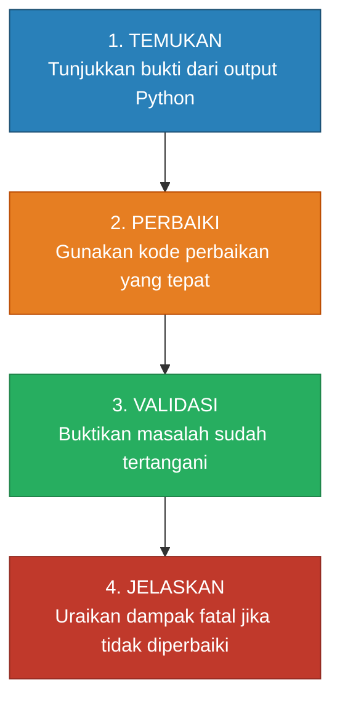

<div align="center">

# 📊 ML-06: Python for Machine Learning (Data Preparation Pipeline)

### Mata Kuliah: INF2542 • Pembelajaran Mesin | Praktikum Modul 06

[](https://www.python.org/)
[](https://jupyter.org/)
[](https://numpy.org/)
[](https://pandas.pydata.org/)
[](https://matplotlib.org/)
[](https://scikit-learn.org/)
[](LICENSE)

<p align="center">
  <b>Dokumentasi komprehensif alur pengolahan data machine learning: Dari Data Mentah → Inspeksi Kualitas → Pembersihan (Cleaning) → Transformasi Kategori & Tipe Data → Visualisasi Informasi → Pemisahan Fitur dan Target Siap Dimodelkan (Scikit-Learn).</b>
</p>

---

[📌 Identitas Mahasiswa](#-identitas-mahasiswa) •
[📖 Pendahuluan & Workflow](#-pendahuluan--workflow-pipeline) •
[📚 Rangkuman Sintaks Slide PDF](#-rangkuman-sintaks-slide-pdf) •
[🧪 Bedah Praktikum Terbimbing](#-bedah-praktikum-terbimbing) •
[🎯 Latihan Mandiri (A, B, C)](#-latihan-mandiri-di-colab) •
[🏆 Challenge: Temukan 3 Masalah Data](#-challenge-temukan-3-masalah-data) •
[✅ Checklist Ketercapaian](#-checklist-ketercapaian-refleksi) •
[🚀 Cara Menjalankan](#-cara-menjalankan-notebook)

---

</div>

## 📌 Identitas Mahasiswa

<table align="center">
  <tr>
    <th>Informasi</th>
    <th>Keterangan</th>
  </tr>
  <tr>
    <td><b>Nama Lengkap</b></td>
    <td>Gathan Hilabi</td>
  </tr>
  <tr>
    <td><b>Nomor Induk Mahasiswa (NIM)</b></td>
    <td>60324059</td>
  </tr>
  <tr>
    <td><b>Mata Kuliah</b></td>
    <td>Machine Learning (INF2542)</td>
  </tr>
  <tr>
    <td><b>Modul / Pertemuan</b></td>
    <td>Pertemuan 06 – Python for Machine Learning</td>
  </tr>
  <tr>
    <td><b>Sub-CPMK</b></td>
    <td>Sub-CPMK 9.1: Terampil menggunakan pustaka Python dan menggunakannya untuk membangun proses pengolahan data ML</td>
  </tr>
  <tr>
    <td><b>Alokasi Waktu Pembelajaran</b></td>
    <td>Blok Minggu 06–07 (300 Menit)</td>
  </tr>
  <tr>
    <td><b>File Notebook Utama</b></td>
    <td><code>059_GathanHilabi_Pertemuan06.ipynb</code><br/><code>059_GathanHilabi_Challenge_Pertemuan06.ipynb</code> (Khusus Challenge)</td>
  </tr>
</table>

---

## 📖 Pendahuluan & Workflow Pipeline

### Filosofi Data Preparation:
> *"Garbage In, Garbage Out"* (GIGO). Model machine learning secanggih apa pun tidak akan pernah menghasilkan prediksi yang optimal jika dilatih menggunakan data mentah yang kotor, terdistorsi, atau inkonsisten.

Data cleaning **bukan tahap terpisah** dari machine learning, melainkan merupakan pondasi awal paling krusial dalam *machine learning pipeline*. 

```mermaid
flowchart LR
    A["1. Load Data<br/>(CSV / Tabel)"] --> B["2. Inspect<br/>(head, info, isna)"]
    B --> C["3. Clean<br/>(missing, duplicate, type)"]
    C --> D["4. Transform<br/>(Standarisasi Kategori)"]
    D --> E["5. Visualize<br/>(Histogram, Boxplot, Scatter)"]
    E --> F["6. Prepare<br/>(Matriks X, Target y, Split)"]
    F --> G["7. Model<br/>(Scikit-Learn Ready)"]

    style A fill:#3498db,stroke:#2980b9,color:#fff
    style B fill:#1abc9c,stroke:#16a085,color:#fff
    style C fill:#e67e22,stroke:#d35400,color:#fff
    style D fill:#2980b9,stroke:#1f618d,color:#fff
    style E fill:#27ae60,stroke:#229954,color:#fff
    style F fill:#e74c3c,stroke:#c0392b,color:#fff
    style G fill:#9b59b6,stroke:#8e44ad,color:#fff
```



**Prinsip Utama Praktikum:**  
*Jangan membersihkan data tanpa tahu masalah apa yang sedang diperbaiki!* Setiap tindakan pembersihan data wajib didasarkan pada temuan empiris output Python dan memiliki alasan konteks yang jelas.

---

## 📚 Rangkuman Sintaks Slide PDF

Seluruh kode dalam notebook praktikum diimplementasikan dengan kepatuhan 100% terhadap sintaks resmi slide:

| Slide | Topik / Modul | Sintaks Utama Python Sesuai PDF | Fungsi / Tujuan |
|---|---|---|---|
| **Slide 06** | **NumPy Fondasi** | `X = np.array([...])`<br/>`X.shape`, `X.mean(axis=0)`, `X.min(axis=0)`, `X.max(axis=0)` | Representasi array numerik 2D, inspeksi dimensi, dan kalkulasi statistik kolom (`axis=0`). |
| **Slide 07** | **Pandas Load** | `df = pd.read_csv("data_mahasiswa.csv")`<br/>`df.head()`, `df.shape`, `df.columns`, `df.info()` | Membaca data tabular CSV, cek ringkasan struktur, tipe data, dan nilai non-null. |
| **Slide 08** | **Inspeksi Awal** | `df.isna().sum()`, `df.duplicated().sum()`, `df.describe()` | Deteksi keberadaan nilai kosong (*missing*), baris berulang (*duplikasi*), dan statistik deskriptif. |
| **Slide 10** | **Cleaning: Missing** | `df["IPK"] = df["IPK"].fillna(df["IPK"].median())` | Imputasi nilai hilang dengan nilai median yang kebal terhadap pencilan (*outliers*). |
| **Slide 11** | **Cleaning: Duplikasi** | `df = df.drop_duplicates()` | Menghapus observasi identik berulang agar setiap entitas unik hanya dihitung satu kali. |
| **Slide 12** | **Cleaning: Tipe Data** | `df["Kehadiran"] = pd.to_numeric(df["Kehadiran"], errors="coerce")`<br/>`df["IPK"] = pd.to_numeric(df["IPK"], errors="coerce")` | Menjamin data numerik tidak tersimpan sebagai string teks (`object`). |
| **Slide 13** | **Cleaning: Kategori** | `df["Status"] = df["Status"].astype(str).str.strip().str.lower()`<br/>`df["Status"] = df["Status"].replace(mapping)` | Menghilangkan spasi liar, menyamakan huruf kecil, dan memetakan ke kategori baku (`Lulus`, `Tidak Lulus`). |
| **Slide 14** | **Validasi Pasca-Clean** | Validasi 4 Check: `shape`, `isna().sum()`, `duplicated().sum()`, `dtypes`, `value_counts()` | Memastikan dataset bersih 100% sebelum masuk tahap eksplorasi & visualisasi. |
| **Slide 15** | **Visualisasi 1** | `plt.hist(df["IPK"], bins=6)` | Melihat bentuk distribusi frekuensi variabel numerik kontinu IPK. |
| **Slide 16** | **Visualisasi 2** | `df.boxplot(column="Kehadiran", by="Status")` | Membandingkan sebaran distribusi persentase kehadiran terhadap status kelulusan. |
| **Slide 17** | **Pandas GroupBy** | `df.groupby("Status").agg(...)` | Meringkas rata-rata nilai fitur prediktor per kelompok target. |
| **Slide 18** | **Scikit-Learn Split** | `X_train, X_test, y_train, y_test = train_test_split(X, y, test_size=0.2, random_state=42)` | Memisahkan matriks fitur $X$ dan target $y$, serta membagi set latih dan set uji secara jujur. |

---

## 🧪 Bedah Praktikum Terbimbing

### 1. NumPy: Fondasi Representasi Numerik
- Data observasi diatur dalam bentuk matriks 2D: baris menyatakan sampel observasi (mahasiswa) dan kolom menyatakan fitur numerik (`Kehadiran`, `IPK`, `Jam_Belajar`).
- Penggunaan `axis=0` melakukan agregasi per kolom:
  - Rata-rata Kehadiran = 84.33%
  - Rata-rata IPK = 3.50
  - Rata-rata Jam Belajar = 6.67 jam/minggu

### 2. Investigasi Data Mentah (`data_mahasiswa.csv`)
- **Dimensi Awal:** 21 baris dan 6 kolom.
- **Masalah Teridentifikasi:**
  1. *Missing Value:* Baris Maya (Kehadiran kosong) dan Fajar (IPK kosong).
  2. *Duplikasi:* Baris mahasiswa bernama Evi tercatat 2 kali (baris 4 dan baris 20).
  3. *Tipe Data:* Kolom Kehadiran dan IPK perlu dipastikan bertipe `float64`.
  4. *Inkonsistensi Kategori:* Kolom Status memiliki variasi penulisan: `Lulus`, `lulus`, `LULUS`, `lulus `, `Tidak Lulus`, `tidak lulus`.

### 3. Eksekusi Pembersihan & Transformasi
- **Missing Value:** Diimputasi dengan nilai median (`IPK` median = 3.475, `Kehadiran` median = 81.0).
- **Duplikasi:** Berhasil dibuang dengan `drop_duplicates()`, ukuran data menyusut dari 21 menjadi 20 observasi unik.
- **Tipe Data:** Dikonversi secara eksplisit menggunakan `pd.to_numeric()`.
- **Kategori Target:** Distandarisasi menghasilkan 13 mahasiswa Lulus dan 7 mahasiswa Tidak Lulus.

### 4. Visualisasi & Eksplorasi
- **Histogram IPK:** Menunjukkan sebaran condong ke kanan (*left-skewed*), mayoritas mahasiswa berada di rentang IPK tinggi (3.40 – 3.90).
- **Boxplot Kehadiran vs Status:** Memperlihatkan pemisahan tegas di mana kelompok Lulus memiliki median kehadiran ~86% sedangkan kelompok Tidak Lulus memiliki median kehadiran ~68%.
- **GroupBy Metrik:**
  | Status | Rata-rata Kehadiran (%) | Rata-rata IPK | Rata-rata Jam Belajar (jam/minggu) |
  |---|:---:|:---:|:---:|
  | **Lulus** | 85.38 | 3.58 | 6.77 |
  | **Tidak Lulus** | 66.00 | 3.05 | 3.43 |

### 5. Scikit-Learn Train-Test Split
- Fitur $X$: `['Kehadiran', 'IPK', 'Jam_Belajar']` berdimensi `(20, 3)`.
- Target $y$: `['Status']` berdimensi `(20,)`.
- Pembagian data dengan `test_size=0.2` dan `random_state=42`:
  - `X_train`: **16 baris, 3 kolom**
  - `X_test`: **4 baris, 3 kolom**

---

## 🎯 Latihan Mandiri di Colab

### Latihan A: Strategi Missing Value (Median vs Mean)
- **Hasil Kuantitatif:**
  - Nilai Median IPK: **3.4750**
  - Nilai Mean IPK: **3.3975**
  - Selisih Imputasi: **0.0775**
- **Interpretasi (3–5 Kalimat):**
  1. Pengisian *missing value* menggunakan nilai median menghasilkan angka 3.4750, sedangkan strategi mean menghasilkan angka 3.3975 dengan selisih absolut sebesar 0.0775.
  2. Perbedaan nilai ini terjadi karena rata-rata (*mean*) sangat dipengaruhi oleh observasi bernilai rendah seperti Joko (IPK 2.75) dan Deni (IPK 2.90) yang menarik nilai rata-rata keseluruhan ke bawah.
  3. Sebaliknya, median lebih kebal (*robust*) terhadap kemiringan sebaran (*skewness*) karena median hanya mengambil titik tengah dari data yang diurutkan.
  4. Pada dataset berukuran kecil dengan distribusi yang condong (*skewed*), imputasi median lebih direkomendasikan karena merepresentasikan kecenderungan sentral data secara lebih realistis tanpa mendistorsi sebaran asli mahasiswa.

---

### Latihan B: Scatter Plot Kehadiran vs IPK
- **Visualisasi:** Scatter plot dengan pembedaan warna hijau untuk `Lulus` dan merah untuk `Tidak Lulus`, lengkap dengan label sumbu, judul, dan legenda.
- **Interpretasi (3–5 Kalimat):**
  1. Scatter plot memperlihatkan adanya pola korelasi positif yang sangat kuat dan teratur antara tingkat kehadiran dengan capaian IPK mahasiswa.
  2. Terlihat pengelompokan (*clustering*) visual yang sangat nyata: mahasiswa yang Lulus berkumpul di area kanan atas dengan kehadiran $\ge 75\%$ dan IPK $\ge 3.20$.
  3. Sementara itu, seluruh mahasiswa yang Tidak Lulus terisolasi di area kiri bawah dengan kehadiran $<75\%$ dan IPK $<3.20$.
  4. Batas pemisah linier yang jelas antara kedua kelompok ini mengindikasikan bahwa model klasifikasi (seperti Logistic Regression atau SVM) akan mampu mempelajari pola keputusan (*decision boundary*) dengan tingkat akurasi yang sangat tinggi.

---

### Latihan C: Ubah `test_size` (0.2 → 0.3)
- **Perbandingan Ukuran:**
  - `test_size=0.2` (80:20): Data Train = **16 baris**, Data Test = **4 baris**.
  - `test_size=0.3` (70:30): Data Train = **14 baris**, Data Test = **6 baris**.
  - Perubahan: Data Train berkurang 2 baris, Data Test bertambah 2 baris.
- **Interpretasi (3–5 Kalimat):**
  1. Mengubah parameter `test_size` dari 0.2 menjadi 0.3 menggeser pembagian data dari formasi 16 data latih dan 4 data uji menjadi 14 data latih dan 6 data uji.
  2. Penambahan data uji menjadi 6 sampel memberikan dasar evaluasi yang sedikit lebih representatif untuk menguji ketahanan generalisasi model terhadap ragam sampel baru.
  3. Namun, karena dataset ini memiliki ukuran sampel yang terbatas (total 20 observasi), berkurangnya data latih menjadi 14 sampel dapat membatasi kemampuan model dalam mempelajari variasi data secara menyeluruh.
  4. Eksperimen ini menegaskan pentingnya menyeimbangkan *trade-off* antara ketersediaan data latih yang cukup untuk proses belajar model dengan kecukupan data uji untuk pengujian performa yang objektif.

---

## 🏆 Challenge: Temukan 3 Masalah Data

Penyelesaian challenge dilakukan pada dataset khusus: `data_mahasiswa_challenge.csv` dengan menerapkan kerangka 4 langkah sistematis:



### Masalah 1: Missing Values
- **1. Temukan:** `df_ch.isna().sum()` mendeteksi 1 nilai kosong pada `Kehadiran` (Mira) dan 1 nilai kosong pada `IPK` (Farhan).
- **2. Perbaiki:** Imputasi nilai median fitur: `df_ch['Kehadiran'].fillna(median)` dan `df_ch['IPK'].fillna(median)`.
- **3. Validasi:** `df_ch.isna().sum()` menghasilkan angka 0 di seluruh kolom.
- **4. Jelaskan Dampak:** Model Scikit-Learn (seperti Logistic Regression atau SVM) akan langsung mengalami *crash* saat pelatihan dengan pesan error `ValueError: Input contains NaN, infinity or a value too large for dtype('float64')`.

### Masalah 2: Duplikasi Baris
- **1. Temukan:** `df_ch.duplicated().sum()` mendeteksi 1 baris duplikat penuh, yaitu mahasiswa bernama Kevin yang tercatat pada indeks 10 dan 25.
- **2. Perbaiki:** `df_ch = df_ch.drop_duplicates()`.
- **3. Validasi:** Duplikasi berkurang menjadi 0 dan dimensi data berkurang dari 26 menjadi 25 baris.
- **4. Jelaskan Dampak:** Menimbulkan bias pembobotan ganda pada sampel tertentu dan memicu *overfitting*. Jika baris duplikat terpisah ke train dan test set, terjadi kebocoran data (*data leakage*) yang menghasilkan metrik akurasi palsu (*overoptimistic*).

### Masalah 3: Format Desimal Tanda Koma & Tipe Data String
- **1. Temukan:** Kolom `IPK` bertipe data `object` (string) karena nilai IPK mahasiswa bernama Vino tertulis `"3,55"` menggunakan tanda koma desimal berkutip.
- **2. Perbaiki:** `df_ch['IPK'] = pd.to_numeric(df_ch['IPK'].astype(str).str.replace(',', '.'), errors='coerce')`.
- **3. Validasi:** Kolom `IPK` berhasil bertransformasi menjadi tipe data `float64` dan fungsi statistik `mean()` dapat dijalankan.
- **4. Jelaskan Dampak:** Matriks aljabar linier dan algoritma ML tidak dapat melakukan operasi aritmatika pada teks string, memicu fatal runtime error `ValueError: could not convert string to float: '3,55'`.

### Masalah 4 (Bonus Temuan): Inkonsistensi Kategori Target Status
- **1. Temukan:** `value_counts()` menampilkan 7 variasi label status karena perbedaan spasi (`lulus `, ` Tidak Lulus`) dan huruf besar/kecil (`lulus`, `LULUS`).
- **2. Perbaiki:** `.astype(str).str.strip().str.lower().replace({'lulus': 'Lulus', 'tidak lulus': 'Tidak Lulus'})`.
- **3. Validasi:** Target konsisten menjadi 2 kategori biner: `Lulus` dan `Tidak Lulus`.
- **4. Jelaskan Dampak:** Model biner keliru menganggap masalah sebagai multi-kelas 7 kategori, merusak formulasi fungsi loss (*cross-entropy*) dan evaluasi metrik akurasi.

---

## ✅ Checklist Ketercapaian (Refleksi)

Semua target ketercapaian pada Slide 23 telah terpenuhi (Target: 6/6):

| No | Target Ketercapaian Slide 23 | Status | Bukti Pembuktian Kode / Penjelasan |
|:---:|---|:---:|---|
| 1 | **Membaca CSV menjadi DataFrame** | ✅ Tercapai | Menggunakan `pd.read_csv("data_mahasiswa.csv")` untuk memuat data mentah menjadi objek tabel terstruktur. |
| 2 | **Mengecek missing value dan duplikasi** | ✅ Tercapai | Menggunakan `df.isna().sum()` dan `df.duplicated().sum()` untuk mendeteksi data cacat. |
| 3 | **Memperbaiki tipe data yang tidak sesuai** | ✅ Tercapai | Menggunakan `pd.to_numeric(..., errors='coerce')` dan `.str.replace(',', '.')` untuk menstandarkan kolom numerik. |
| 4 | **Membuat minimal dua visualisasi** | ✅ Tercapai | Menghasilkan Histogram Distribusi IPK, Boxplot Kehadiran vs Status, serta Scatter Plot Kehadiran vs IPK. |
| 5 | **Memahami perbedaan fitur ($X$) dan target ($y$)** | ✅ Tercapai | Memisahkan matriks independen $X$ (`Kehadiran`, `IPK`, `Jam_Belajar`) dari vektor dependen $y$ (`Status`). |
| 6 | **Menjelaskan urgensi data cleaning sebelum modeling** | ✅ Tercapai | Memaparkan prinsip GIGO, pencegahan eksepsi runtime Scikit-Learn, mitigasi bias, dan pencegahan *data leakage*. |

---

## 🚀 Cara Menjalankan Notebook

### Prasyarat Dependensi:
Pastikan Python 3.9+ dan pustaka berikut telah terinstal pada environment Anda:
```bash
pip install numpy pandas matplotlib scikit-learn jupyter
```

### Menjalankan Jupyter Notebook:
1. Buka terminal pada folder proyek ini:
   ```bash
   cd "c:\Users\LENOVO\Documents\PERSONAL GATHAN\PROJECT 2026\ML\MAKUL ML pertemuan 6"
   ```
2. Jalankan server Jupyter Notebook:
   ```bash
   jupyter notebook 059_GathanHilabi_Pertemuan06.ipynb
   ```
3. Atau jalankan di VS Code / Antigravity IDE dengan membuka file `059_GathanHilabi_Pertemuan06.ipynb` dan memilih kernel Python yang aktif.
4. Pilih menu **Run All** untuk mengeksekusi seluruh 74 sel (sel teks markdown dan sel kode berserta output grafik visual).

---

<div align="center">
  <b>© 2026 Gathan Hilabi (60324059) • INF2542 Pembelajaran Mesin • Pertemuan 06</b>
</div>
